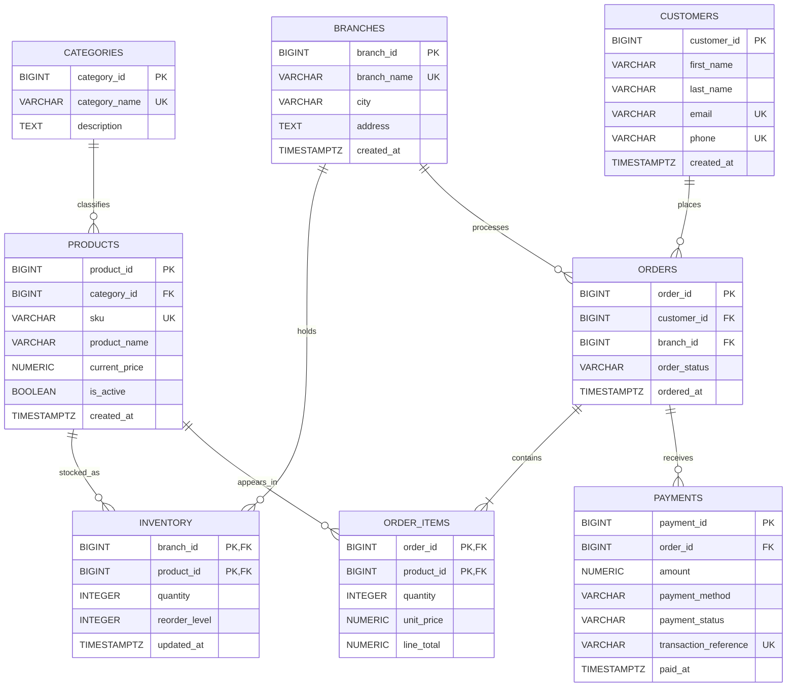

# Entity Relationship Diagram

## Relationship Summary

- One category can classify many products.
- A branch can hold many products through the inventory table.
- A product can be stocked in many branches.
- One customer can place many orders.
- One branch can process many orders.
- An order contains one or more order items.
- A product can appear in many order items.
- An order can receive one or more payment records.