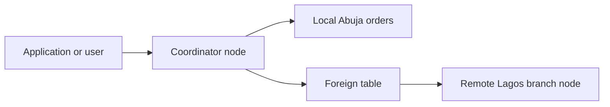

# Portfolio 5: Distributed Database Exercise

## Student

Yusuf Abbas

## Objective

This portfolio demonstrates a distributed relational database using two PostgreSQL 16 nodes connected through PostgreSQL Foreign Data Wrapper (`postgres_fdw`).

## Architecture



The coordinator runs on port `5433`, while the remote branch node runs on port `5434`. Both nodes operate independently within a Docker network.

## Data Distribution

Orders are horizontally distributed by branch:

| Node | Data | Orders | Revenue |
|---|---|---:|---:|
| Coordinator node | Abuja Central Branch | 5 | 2,810,000.00 |
| Remote branch node | Lagos Island Branch | 5 | 2,670,500.00 |
| Distributed total | Both branches | 10 | 5,480,500.00 |

## Implementation

The remote node stores Lagos branch orders in the `branch_orders` table.

The coordinator stores Abuja orders in `local_orders` and accesses the Lagos data through the `remote_branch_orders` foreign table.

A unified `all_branch_orders` view combines local and remote records using `UNION ALL`. Users can therefore query both locations through the coordinator without separately connecting to each database.

## PostgreSQL Foreign Data Wrapper

The coordinator uses `postgres_fdw` to:

- Connect to the remote PostgreSQL node
- Map a restricted remote user
- Represent the remote table as a local foreign table
- Execute queries against both nodes
- Return combined distributed results

## Security

A dedicated `fdw_reader` account is used for remote access. It receives only:

- Database connection permission
- Schema usage permission
- `SELECT` permission on the remote table

The password is supplied through a `psql` variable and is not stored directly in the tracked SQL files.

## Validation Results

The tests confirmed:

- Five orders exist on each node
- Distributed revenue equals `5,480,500.00`
- No duplicate order identifiers exist
- Remote records are accessible from the coordinator
- PostgreSQL reports a `Foreign Scan` for the remote query
- Revenue aggregation works across both nodes
- All distributed database tests completed successfully

## Running the Environment

From the repository root:

```powershell
docker compose --env-file .\.env -f .\portfolio-5-distributed-cloud\docker-compose-distributed.yml up -d
```

Check the containers:

```powershell
docker compose --env-file .\.env -f .\portfolio-5-distributed-cloud\docker-compose-distributed.yml ps
```

Set a temporary PowerShell variable for the FDW password:

```powershell
$fdwPassword = "your_secure_fdw_password"
```

Configure the remote node:

```powershell
Get-Content .\portfolio-5-distributed-cloud\branch-node-setup.sql -Raw | docker exec -i mit8103-branch-node psql -v ON_ERROR_STOP=1 -v fdw_password=$fdwPassword -U mit8103 -d distributed_retail
```

Configure the coordinator:

```powershell
Get-Content .\portfolio-5-distributed-cloud\coordinator-setup.sql -Raw | docker exec -i mit8103-coordinator psql -v ON_ERROR_STOP=1 -v fdw_password=$fdwPassword -U mit8103 -d distributed_retail
```

Run validation:

```powershell
Get-Content .\portfolio-5-distributed-cloud\distributed-validation.sql -Raw | docker exec -i mit8103-coordinator psql -v ON_ERROR_STOP=1 -U mit8103 -d distributed_retail
```

## Files

- `docker-compose-distributed.yml`: Defines the two PostgreSQL nodes
- `branch-node-setup.sql`: Configures the remote Lagos node
- `branch-node-results.txt`: Remote setup evidence
- `coordinator-setup.sql`: Configures the coordinator and foreign table
- `coordinator-results.txt`: Distributed query evidence
- `distributed-validation.sql`: Distributed database tests
- `distributed-validation-results.txt`: Validation evidence

## Conclusion

The implementation demonstrates horizontal data distribution, remote data access, restricted permissions and transparent cross-node querying. PostgreSQL FDW allows the coordinator to combine independently stored branch records while preserving their separate physical locations.
## Node Failure and Recovery Test

A controlled resilience test was performed to demonstrate the effect of remote-node failure.

The remote branch node was stopped while the coordinator remained active. A query against the foreign table failed because the coordinator could not reach the remote PostgreSQL server. This confirmed that the system correctly detected remote-node unavailability.

The branch node was then restarted and returned to a healthy state. The same foreign-table query subsequently succeeded and returned:

- 5 recovered remote orders
- Remote revenue of 2,670,500.00

This test demonstrates failure detection, service recovery and the restoration of distributed query access.

The supporting evidence is available in:

- `failure-recovery-test.ps1`
- `failure-recovery-results.txt`